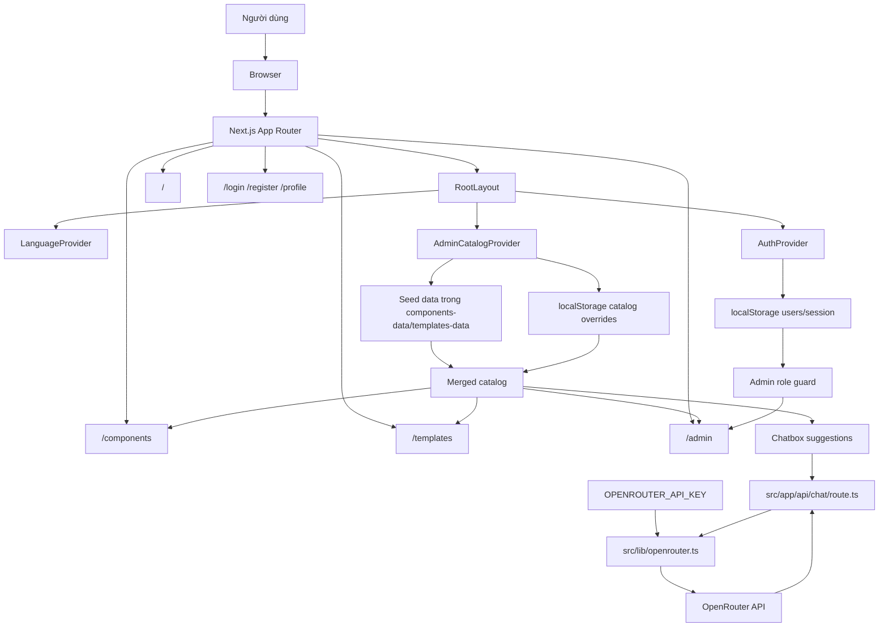
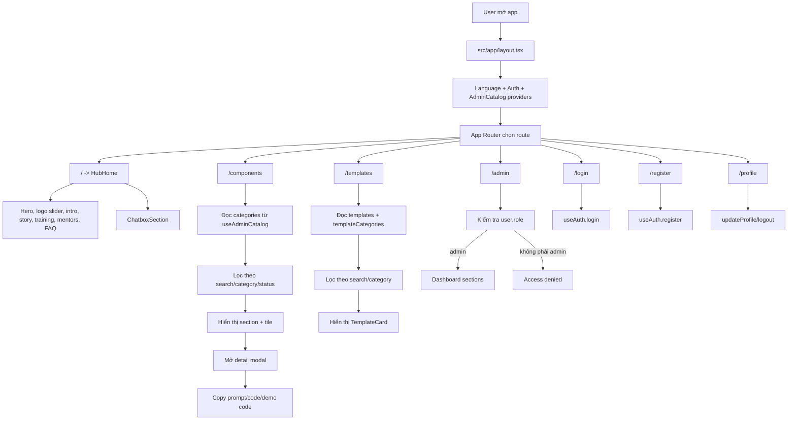
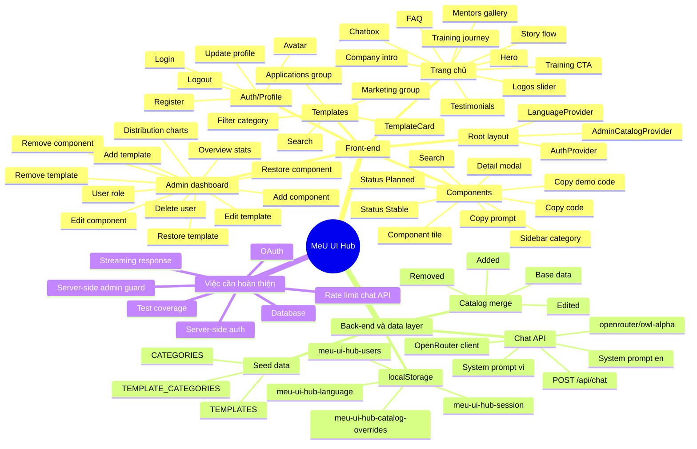
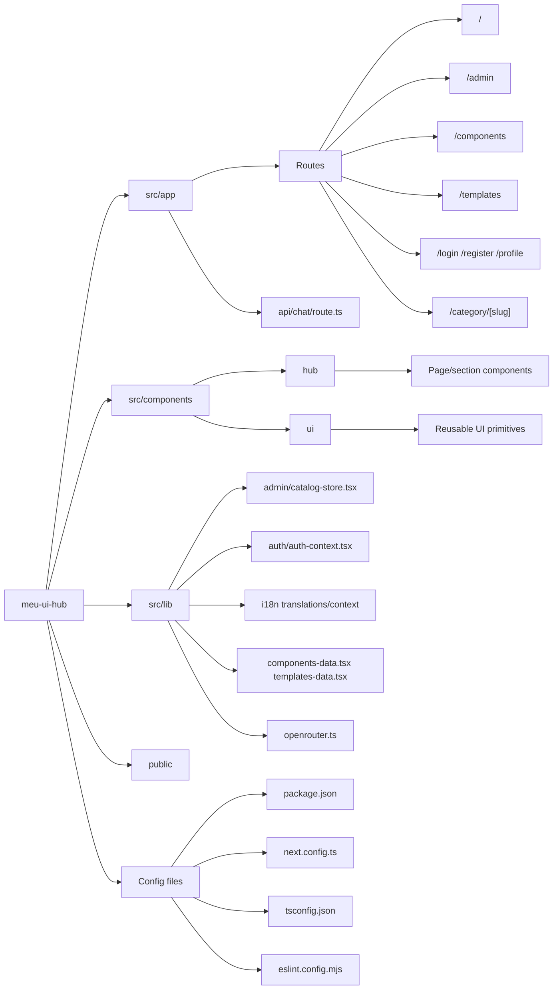
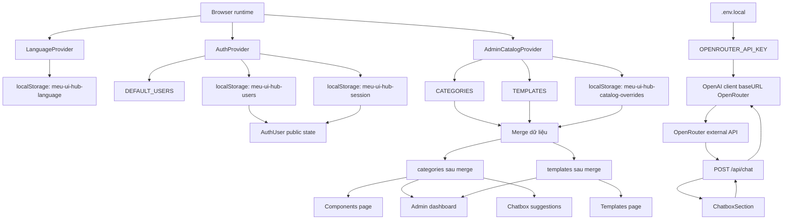
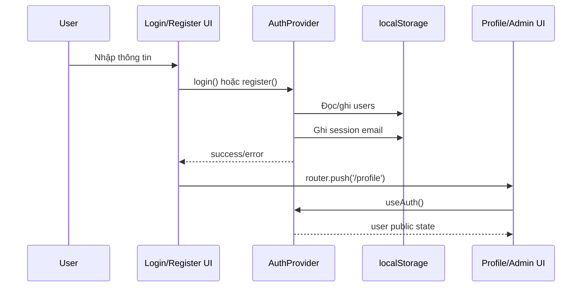
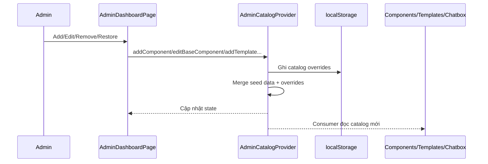
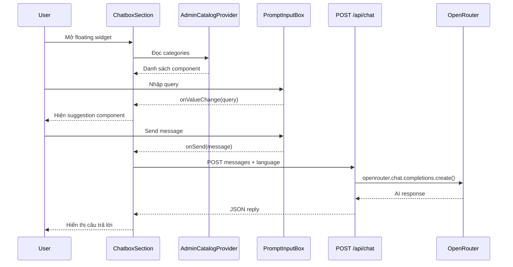

# Báo cáo review công việc 23-24/06/2026

## Thông tin chung

- Dự án: MeU UI Hub
- Stack: Next.js 16 App Router, React 19, TypeScript, Tailwind CSS v4, Radix UI, GSAP, Framer Motion, OpenAI SDK qua OpenRouter
- Phạm vi review: tài liệu README, luồng front-end, luồng back-end/data layer, admin catalog, auth demo, chatbox và OpenRouter
- Ghi chú hiện trạng: đã có route `/api/chat` gọi OpenRouter; chưa có database và dữ liệu demo vẫn đang lưu bằng `localStorage`

## Công việc ngày 23/06/2026

- Rà soát cấu trúc dự án Next.js App Router: `src/app`, `src/components/hub`, `src/components/ui`, `src/lib`.
- Chuẩn hóa README từ nội dung mặc định của Next.js sang tài liệu nội bộ cho MeU UI Hub.
- Ghi nhận stack, scripts, biến môi trường và cấu trúc thư mục chính.
- Review các provider toàn app:
  - `LanguageProvider` quản lý ngôn ngữ `vi/en`.
  - `AuthProvider` quản lý login/register/profile/role demo.
  - `AdminCatalogProvider` quản lý dữ liệu category/component/template.
- Bổ sung nền tảng OpenRouter:
  - Thêm dependency `openai`.
  - Tạo `src/lib/openrouter.ts`.
  - Tài liệu hóa `OPENROUTER_API_KEY` trong `.env.local`.
- Review chatbox hiện tại: có UI, lưu message trong state và chuẩn bị luồng gọi model qua OpenRouter.

## Công việc ngày 24/06/2026

- Hoàn thiện file báo cáo review này để phục vụ báo cáo công việc.
- Cập nhật README với link báo cáo, map quy trình front-end và map quy trình back-end/data layer.
- Tổng hợp đầy đủ các route chính:
  - `/` trang hub landing.
  - `/components` catalog component.
  - `/templates` catalog template.
  - `/admin` dashboard quản trị.
  - `/login`, `/register`, `/profile` auth/profile demo.
  - `/category/[slug]` redirect về `/components`.
- Ghi nhận cải tiến chatbox:
  - Chuyển sang floating widget.
  - Có trạng thái mở/đóng.
  - Có query state được control từ `PromptInputBox`.
  - Gợi ý component dựa trên catalog từ `useAdminCatalog()`.
  - Gọi `POST /api/chat` để gửi lịch sử chat và ngôn ngữ hiện tại.
  - Có fallback `errorReply` khi request OpenRouter lỗi.
- Ghi nhận back-end chat:
  - Tạo `src/app/api/chat/route.ts`.
  - Route dùng `src/lib/openrouter.ts`.
  - Model hiện tại: `openrouter/owl-alpha`.
  - System prompt có bản tiếng Việt và tiếng Anh.
- Ghi nhận chỉnh UI nhỏ ở navbar: đổi hover menu sang `hover:bg-black/30` để tăng tương phản.
- Xác định các gap còn lại trước production: database, auth server-side, rate limit cho chat API, test coverage, phân quyền server-side.

## Kết quả đạt được

| Hạng mục | Kết quả |
| --- | --- |
| Tài liệu | README đã có stack, hướng dẫn chạy, biến môi trường, cấu trúc chính và process map |
| Báo cáo | Có file báo cáo riêng cho giai đoạn 23-24/06/2026 |
| Front-end | Map rõ luồng route, provider, page, component, modal, filter, chatbox |
| Back-end/data | Map rõ localStorage data layer, auth demo, catalog override và route OpenRouter |
| Admin | Nắm rõ flow add/edit/remove/restore component/template và quản lý user role |
| Chatbox | Có UI widget, suggestion từ catalog và gọi `/api/chat` |

## Map tổng quan hệ thống

## Map quy trình front-end

## Sơ đồ nhánh chức năng

## Sơ đồ nhánh thư mục

### Chi tiết front-end theo route

| Route | Component chính | Vai trò |
| --- | --- | --- |
| `/` | `HubHome` | Trang landing hub, animation, sections giới thiệu, chatbox |
| `/components` | `ComponentsDirectoryPage` | Catalog component, filter, modal chi tiết, copy prompt/code |
| `/templates` | `TemplatesPage` | Catalog template, filter theo nhóm marketing/application |
| `/admin` | `AdminDashboardPage` | Quản trị component/template/user/custom/removed |
| `/login` | `SignIn1` | Login demo qua `AuthProvider` |
| `/register` | `SignUp1` | Register demo qua `AuthProvider` |
| `/profile` | `ProfilePage` | Xem/sửa profile, đổi avatar, logout |
| `/category/[slug]` | `CategoryPage` | Redirect về `/components` |

## Map quy trình back-end / data layer

### Trách nhiệm của data layer hiện tại

| Module | Nhiệm vụ | Persistence |
| --- | --- | --- |
| `src/lib/i18n/language-context.tsx` | Đổi và lưu ngôn ngữ `vi/en` | `localStorage: meu-ui-hub-language` |
| `src/lib/auth/auth-context.tsx` | Login/register/logout/profile/favorites/role demo | `localStorage: meu-ui-hub-users`, `meu-ui-hub-session` |
| `src/lib/admin/catalog-store.tsx` | Merge seed data với override admin | `localStorage: meu-ui-hub-catalog-overrides` |
| `src/lib/components-data.tsx` | Seed category/component và preview JSX | Code static |
| `src/lib/templates-data.tsx` | Seed template/category và preview JSX | Code static |
| `src/app/api/chat/route.ts` | Route nhận message chat và gọi OpenRouter | Server runtime |
| `src/lib/openrouter.ts` | Client server-side cho OpenRouter | `.env.local OPENROUTER_API_KEY` |

## Sequence: auth demo

## Sequence: admin catalog

## Sequence: chatbox gọi OpenRouter

## Đánh giá rủi ro và hạn chế

- Auth hiện chỉ là demo front-end, chưa an toàn cho production vì password và session lưu ở `localStorage`.
- Admin guard hiện kiểm tra role ở client, cần bổ sung server-side guard khi có backend thật.
- Catalog override lưu local theo trình duyệt, chưa đồng bộ giữa user/device.
- Chatbox đã gọi `/api/chat`, nhưng cần `OPENROUTER_API_KEY`; chưa có rate limit, streaming, retry hoặc kiểm soát chi phí.
- Google login/register button là UI placeholder, chưa có OAuth.
- Chưa thấy test tự động cho các luồng admin/auth/catalog/chatbox.
- `.env.local` không nên commit; README chỉ hướng dẫn biến môi trường cần có.

## Đề xuất bước tiếp theo

1. Bổ sung validation, rate limit và kiểm soát lỗi cho `POST /api/chat`.
2. Thiết kế payload chat nâng cao gồm message hiện tại, lịch sử chat và catalog context rút gọn.
3. Chuyển auth demo sang backend thật hoặc provider như NextAuth/Auth.js nếu cần production.
4. Chuyển catalog override từ `localStorage` sang database/API để admin thay đổi có hiệu lực cho toàn team.
5. Bổ sung import/export catalog để sao lưu dữ liệu admin.
6. Thêm test cho auth, catalog merge, admin add/edit/remove/restore và chatbox suggestion.
7. Chạy QA responsive cho `/`, `/components`, `/templates`, `/admin`, `/login`, `/register`, `/profile`.

## Kết luận

Trong giai đoạn 23-24/06/2026, dự án đã được review và tài liệu hóa rõ hơn. Front-end đã có cấu trúc route/component/provider tương đối đầy đủ cho một UI hub nội bộ. Chatbox đã có route gọi OpenRouter. Data layer hiện phù hợp demo nội bộ, còn production cần bổ sung database, auth server-side, kiểm soát chat API và test coverage.
