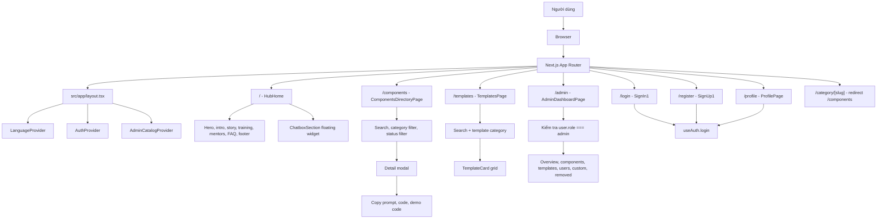
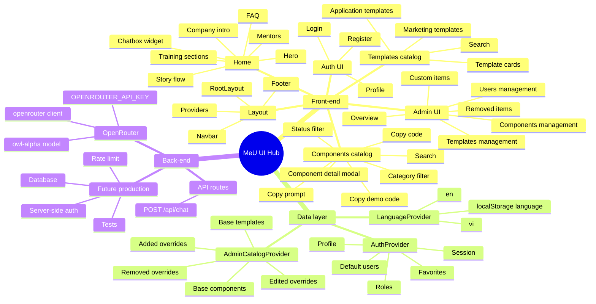
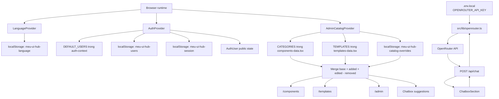

# MeU UI Hub

Design system & component hub nội bộ, xây bằng Next.js. Bao gồm trang catalog component, templates, trang quản trị (admin) để quản lý category/component/template, và một chatbox đã nối AI thật qua OpenRouter.

## Báo cáo review

- File báo cáo chi tiết: [BAO_CAO_REVIEW_23-24-06-2026.md](./BAO_CAO_REVIEW_23-24-06-2026.md)
- Phạm vi review: công việc ngày 23-24/06/2026, luồng front-end, luồng back-end/data layer, trạng thái chatbox/OpenRouter, admin catalog và các điểm cần làm tiếp.

## Stack

- [Next.js 16](https://nextjs.org) (App Router) + React 19 + TypeScript
- Tailwind CSS v4
- Radix UI (`@radix-ui/react-*`) cho các primitive: dialog, popover, select, switch, tabs, tooltip...
- GSAP / Framer Motion / Lenis cho animation & scroll
- `openai` SDK (dùng qua [OpenRouter](https://openrouter.ai)) — đã wire vào chatbox qua `POST /api/chat`

## Bắt đầu

```bash
npm install
npm run dev
```

Mở [http://localhost:3000](http://localhost:3000).

### Biến môi trường

Tạo file `.env.local` ở root:

```bash
OPENROUTER_API_KEY=sk-or-v1-...
```

Key này chỉ dùng server-side (`src/lib/openrouter.ts`), không có prefix `NEXT_PUBLIC_` nên sẽ không bị bundle ra client.

## Cấu trúc chính

```
src/
  app/                  # Routes (App Router): /, /admin, /components, /category/[slug], /templates, /login, /register, /profile
    api/chat/           # Route handler POST /api/chat gọi OpenRouter
  components/
    hub/                # Các trang/section lớn (AdminDashboardPage, ComponentsDirectoryPage, ChatboxSection, ...)
    ui/                 # UI primitives tái dùng (button, sheet, popover, ai-prompt-box, ...)
  lib/
    admin/              # catalog-store: state + persistence cho admin (category/component catalog)
    auth/               # auth-context
    i18n/                # translations (vi/en) + language-context
    openrouter.ts       # OpenRouter (OpenAI-compatible) client, server-side only
```

## Map quy trình front-end



### Luồng front-end chính

1. `RootLayout` bọc toàn bộ app bằng `LanguageProvider`, `AuthProvider`, `AdminCatalogProvider`.
2. Route trong `src/app/*/page.tsx` chỉ làm nhiệm vụ chọn page component tương ứng.
3. Các page lớn nằm ở `src/components/hub`, UI primitive tái dùng nằm ở `src/components/ui`.
4. Trang `/components` đọc catalog đã merge từ `useAdminCatalog()`, hỗ trợ tìm kiếm, lọc category/status, mở modal chi tiết và copy prompt/code.
5. Trang `/templates` đọc template catalog từ `useAdminCatalog()`, lọc theo search và nhóm template.
6. Trang `/admin` chỉ cho user có role `admin`; các thao tác add/edit/remove/restore được ghi vào catalog override.
7. Chatbox là widget nổi, có gợi ý component theo nội dung nhập và gọi `POST /api/chat` (OpenRouter) để trả lời thật.

## Sơ đồ nhánh chức năng



## Map quy trình back-end / data layer

Hiện tại dự án chưa có database. Phần back-end/data layer đang gồm state provider, persistence bằng `localStorage`, dữ liệu seed trong code và route API nội bộ `POST /api/chat` gọi OpenRouter server-side.



### Luồng dữ liệu quan trọng

1. Auth: login/register/profile/user role dùng `AuthProvider`; dữ liệu demo lưu ở `localStorage`, chưa phải xác thực production.
2. Admin catalog: dữ liệu gốc nằm trong `components-data.tsx` và `templates-data.tsx`; thay đổi từ admin được lưu dưới dạng override.
3. Consumer pages: `/components`, `/templates`, `/admin` và chatbox đều đọc catalog sau khi merge override.
4. OpenRouter: `src/lib/openrouter.ts` tạo OpenAI-compatible client dùng `OPENROUTER_API_KEY`; `src/app/api/chat/route.ts` nhận `messages` + `language` từ ChatboxSection, gọi `openrouter.chat.completions.create` và trả `{ reply }`.

## Scripts

| Script          | Mô tả                  |
| --------------- | ----------------------- |
| `npm run dev`   | Chạy dev server          |
| `npm run build` | Build production         |
| `npm run start` | Chạy build production    |
| `npm run lint`  | Lint codebase             |

## Ghi chú

- Đa ngôn ngữ qua `src/lib/i18n` — mọi string hiển thị nên đi qua `translations.ts`, tránh hardcode.
- Admin catalog (category/component/template) lưu qua `src/lib/admin/catalog-store.tsx`.
- Chatbox (`ChatboxSection.tsx`) gọi `POST /api/chat` → `src/lib/openrouter.ts`; nếu request lỗi sẽ hiện `translations.ts` → `chatbox.errorReply`.
- Google login/register button hiện là UI placeholder, chưa nối OAuth thật.
- Dữ liệu auth/admin hiện lưu local trên trình duyệt, phù hợp demo nội bộ nhưng chưa phù hợp production.
